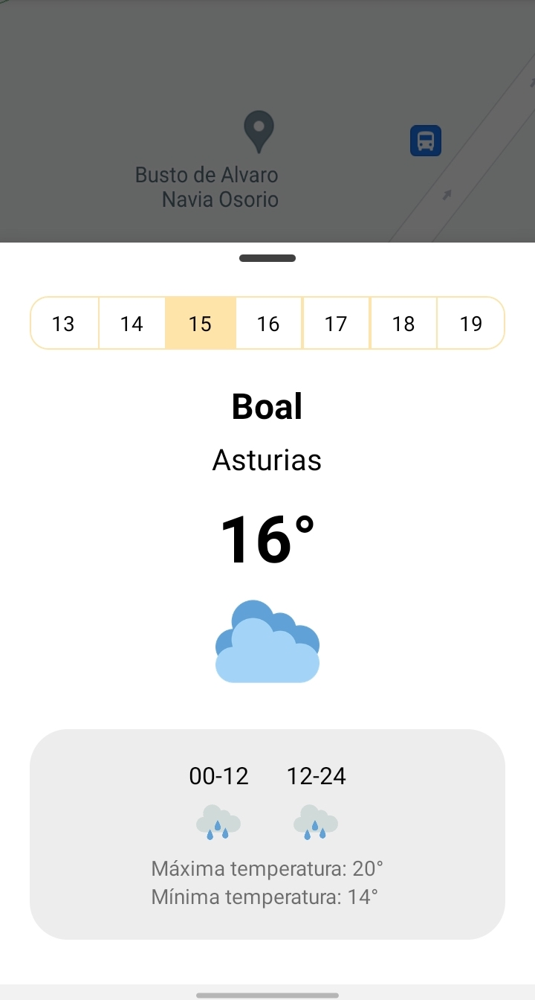
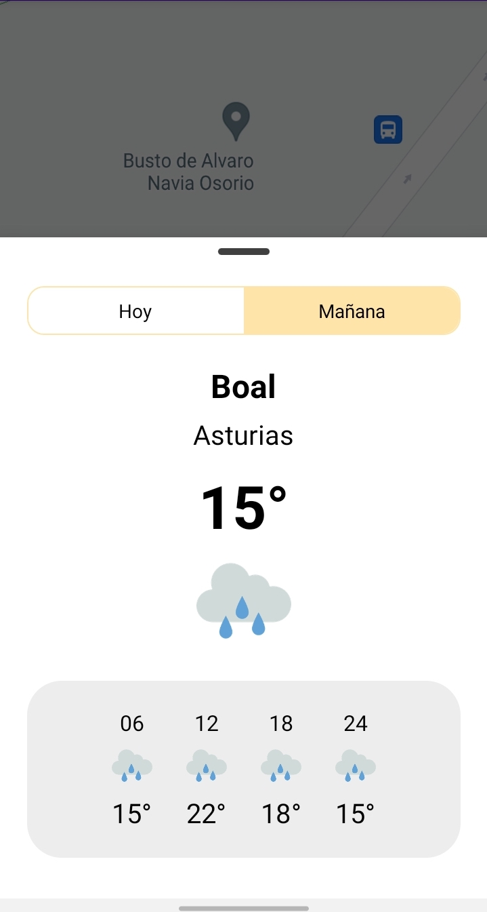
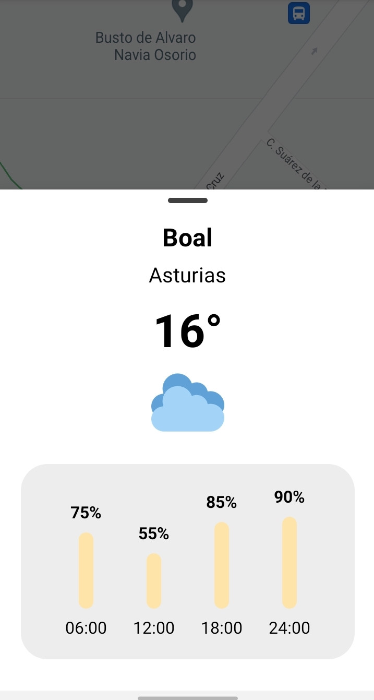
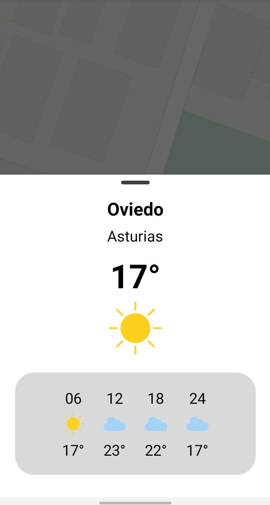

Seresco Weather Utils Android
=======

A weather library for Android using AEMET data

<p float="left">
  
  
  
  
</p>


Usage
--------

e.g. Displaying Weekly Weather Info

```kotlin
private val meteorologyUtils = MeteorologyUtils()

fun openWeatherWeeklySheet() {
    meteorologyUtils.openMeteorologySheet(this, MeteorologyType.WEATHER_WEEKLY, latitude, longitude, supportFragmentManager)
}
```
